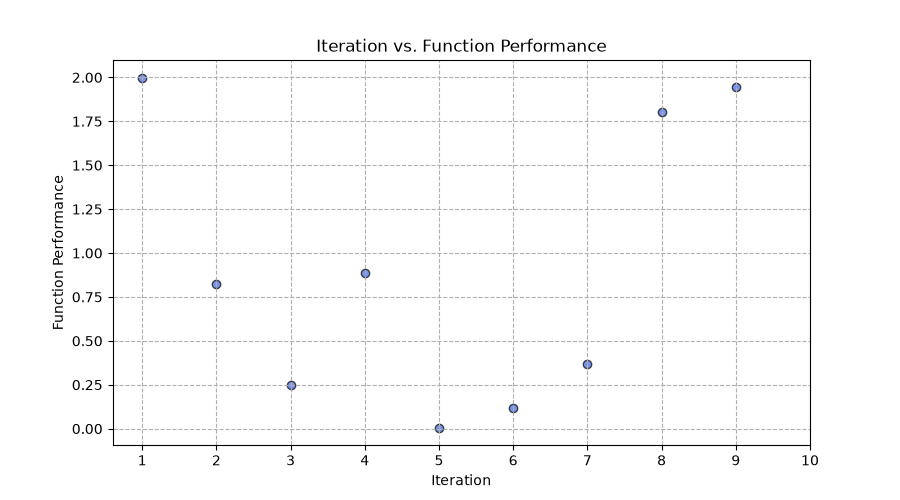
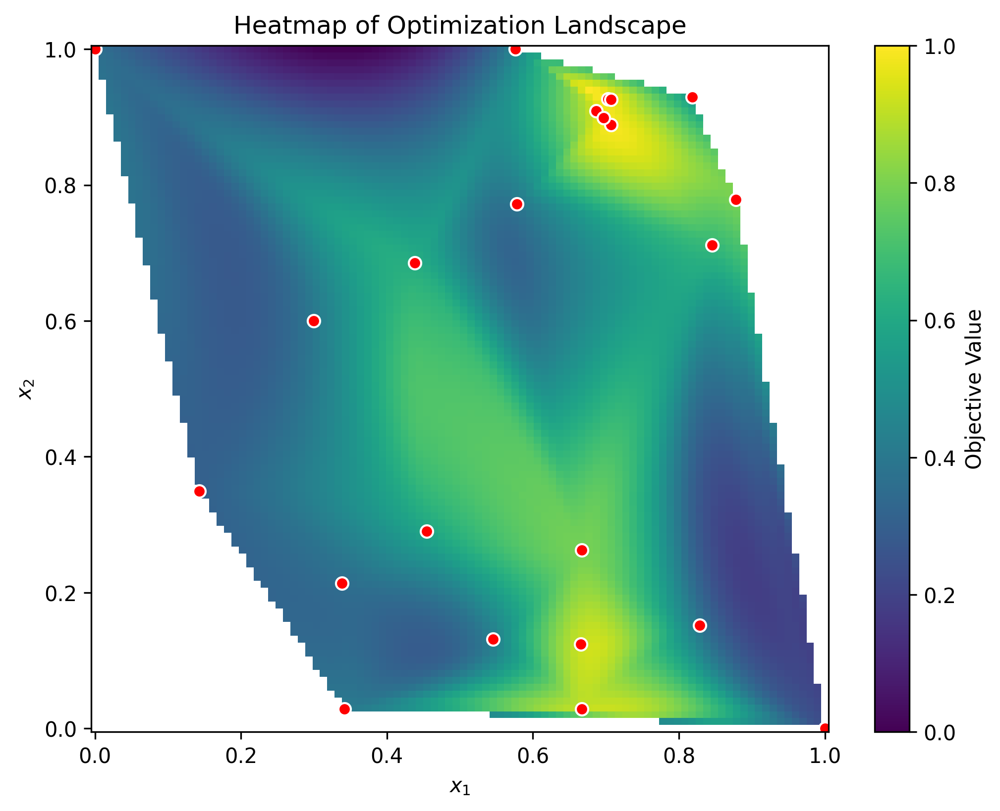
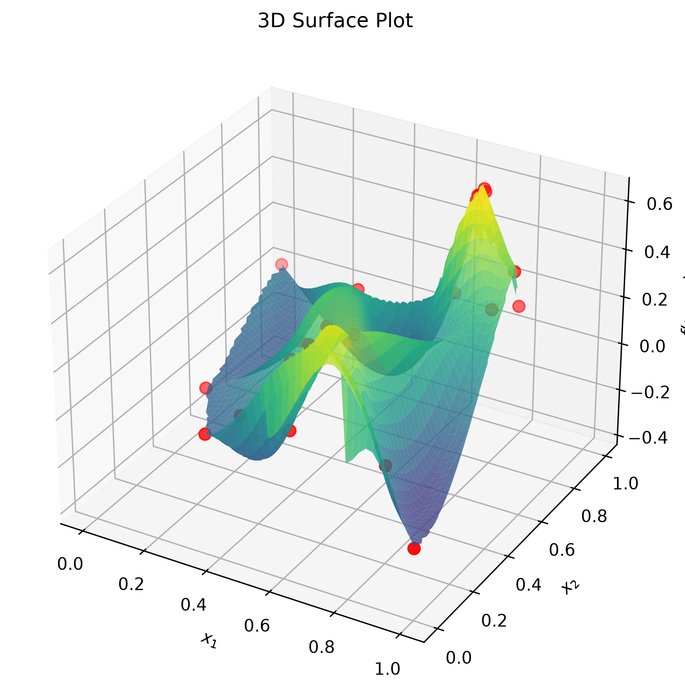

# Black-Box Optimisation of Eight Real-World-Inspired Functions with Bayesian Optimisation

## Description

Imagine you're trying to find the best recipe, drug combination, or warehouse layout, but each real-world test costs time and money, so you can only try one idea per week. This project builds a "smart guesser" that learns from every past result to decide the single most promising thing to try next. It was applied to eight different mystery problems — from detecting contamination and discovering new medicines to tuning a cake recipe and optimising an AI model's settings — using a technique called Bayesian Optimisation. Over thirteen weekly rounds per function, the model balanced exploring the unknown with exploiting what already looked good, gradually homing in on strong solutions for each problem.

## Data

The data comes from **Imperial Executive Education**, as part of the *Professional Certificate in Machine Learning and Artificial Intelligence* (Module 12: Bayesian Optimisation), and is used here as coursework/learning material. Full documentation of the dataset's motivation, composition and collection process is in [data sheet](/DATASHEET.md).

There are eight black-box functions, each with a different input dimensionality (2D–8D) and a different real-world-inspired domain (see [here](archive/README.md) for the full list and example inputs/outputs).

#### **Function composition** (per function, under `function_N/data/`):
  - `initial_inputs.npy` / `initial_outputs.npy` — the starting dataset provided by the course (10–30 rows depending on dimensionality), floating-point values in `[0, 1]` to six decimal places
  - Thirteen additional points were collected incrementally, one per week over thirteen weeks (28/03/2026–02/06/2026), and are appended directly to the input/output arrays inside each function's notebook

#### **Function objective**: 
- Every function is a **maximisation** problem, with the practical constraint of only one candidate query per function per week — mirroring real-world settings where each evaluation (a lab test, a warehouse trial, a training run) is expensive
- The dataset is under an MIT licence and is no longer actively maintained as of 2 July 2026

## Model

Each function is modelled with a **Gaussian Process Regressor**  as the surrogate model, paired with **Expected Improvement (EI)** and **Upper Confidence Bound (UCB)** acquisition functions.

A GP was chosen because it gives a calibrated mean *and* uncertainty estimate at every candidate point from very few observations — exactly what's needed when each real evaluation costs a whole week. The uncertainty estimate is what allows the acquisition functions to trade off exploring uncertain regions against exploiting known good ones.

The kernel choice was adapted to each function's dimensionality:
- **RBF** for the smoothest, lowest-dimensional function (Function 1)
- **Matérn (ν=1.5)** for the other low-dimensional functions (2–3D), a good balance between overly smooth and overly rugged
- **Matérn (ν=2.5)**, often summed with a `WhiteKernel` to absorb observation noise, for the higher-dimensional functions (4D–8D), which is more robust in higher-dimensional search

For proposing the next candidate, low-dimensional functions used dense grid search or a handful of `L-BFGS-B` restarts, while the higher-dimensional functions (6D–8D) used **Sobol-sequence multi-start optimisation** (32–64 starts) followed by `L-BFGS-B` refinement, since exhaustive grid search becomes infeasible as dimensionality grows. 

Functions with with less than three dimensions used various classifiers such as Linear and Logistic regressions, SVMs and NNs to check proposed candidates as likely high or low performers. The functions with three or more dimensions used NNs as it was deemed sufficient to model the non-linearity and for quick sanity check. The classifiers were used for interpretation rather than as part of the acquisition strategy.

## Hyperparameter Optimisation

The core hyperparameters per function are the GP kernel parameters (length scale(s), amplitude, noise/`alpha`) and the acquisition function's exploration parameter (`kappa` for UCB, `xi` for EI). Kernel hyperparameters were fit automatically via sklearn's internal log-marginal-likelihood optimiser, restarted multiple times (`n_restarts_optimizer`, 20–40) to avoid local minima; `kappa`/`xi` and the length-scale bounds were tuned manually week-to-week based on how the previous suggestion performed, and what the heatmap/surface plots revealed in the 2D dimension functions.

A few learnings that shaped the tuning process:
- Several model fits hit their upper `length_scale_bound`  — a signal the bounds needed widening or the model needed more data, addressed by manually re-tightening bounds in later iterations (see Function 8)
- Function 3 and Function 6 models were hungry for exploring "corners of the universe", thereby, prompting a switch to narrower, locally-bounded search once a promising region was found - a manual intervention!
- A bug in Function 6 surrounding a sign in the acquisition logic went unnoticed until mid-project, a useful reminder to sanity-check acquisition direction against the stated maximisation objective - in this case we were interested in maximising in the "negative" direction

## Results

| Function | Domain | Best value found | Best input | Leaderboard (course cohort, 55 participants) |
|---|---|---|---|---|
| 1 | Contamination detection (2D) | ≈ 3.06 × 10⁻⁶ | [0.687, 0.697] | 15 |
| 2 | Mystery model log-likelihood (2D) | 0.6112 | [0.703, 0.927] | 38 |
| 3 | Drug discovery, 3 compounds (3D) | −0.00469 (closest to zero) | [0.851, 0.612, 0.505] | 11 |
| 4 | Warehouse placement (4D) | 0.6576 | [0.413, 0.407, 0.352, 0.425] | 9 |
| 5 | Chemical yield (4D) | 8662 | [0.960914, 0.990000, 0.990000, 0.990000] | 11 |
| 6 | Cake recipe (5D) | -3.136  | [0.009710, 0.979677, 0.029675, 0.011367, 0.857560] | 37 |
| 7 | ML hyperparameter tuning (6D) | 1.9994 | [~0, 0.238, 0.405, 0.122, 0.334, 0.760] | 27 |
| 8 | Unknown 8D function | 9.9122 | [0.043396, 0.053307, 0.137597, 0.000025, 0.776263, 0.493814, 0.043575, 0.567457] | 24 |

#### The week by week performance tracker

Function 7 - weekly function performance against weekly iteration

Function 2 - visualisations for human intution about function performance regions

#### **Summary**
Across all eight functions, exploration-heavy acquisition parameters (high `kappa`/`xi`) in the early iterations successfully mapped out each landscape, and results improved once the search was narrowed to promising regions. The main limitation is that 

More generally, kernel hyperparameters and exploration parameters were tuned manually rather than via a systematic outer-loop search (e.g. cross-validated marginal likelihood comparison), hence, the results reflect a human-in-the-loop BO process rather than a fully automated one — see [model card](/MODEL_CARD.md) for details of limitations and reproducibility.

## Distribution 
Model card and code available in repository for scrutiny and improvement, under MIT license.

Contact
- GitHub: [github.com/sadiqalqrety](https://github.com/sadiqalqrety)
- Email: sadiqalqrety@gmail.com

